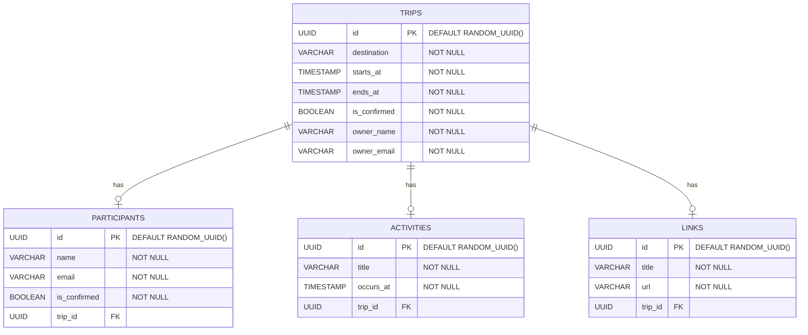

# Api Planner

```mermaid
erDiagram
    TRIPS {
        UUID id PK "DEFAULT RANDOM_UUID()"
        VARCHAR destination "NOT NULL"
        TIMESTAMP starts_at "NOT NULL"
        TIMESTAMP ends_at "NOT NULL"
        BOOLEAN is_confirmed "NOT NULL"
        VARCHAR owner_name "NOT NULL"
        VARCHAR owner_email "NOT NULL"
    }
    
    PARTICIPANTS {
        UUID id PK "DEFAULT RANDOM_UUID()"
        VARCHAR name "NOT NULL"
        VARCHAR email "NOT NULL"
        BOOLEAN is_confirmed "NOT NULL"
        UUID trip_id FK
    }

    ACTIVITIES {
        UUID id PK "DEFAULT RANDOM_UUID()"
        VARCHAR title "NOT NULL"
        TIMESTAMP occurs_at "NOT NULL"
        UUID trip_id FK
    }
    
    LINKS {
        UUID id PK "DEFAULT RANDOM_UUID()"
        VARCHAR title "NOT NULL"
        VARCHAR url "NOT NULL"
        UUID trip_id FK
    }

    TRIPS ||--o| PARTICIPANTS : "has"
    TRIPS ||--o| ACTIVITIES : "has"
    TRIPS ||--o| LINKS : "has"

```
